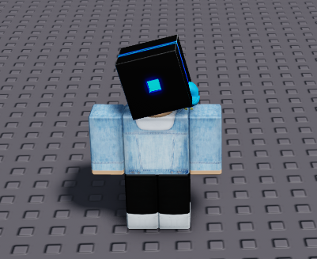
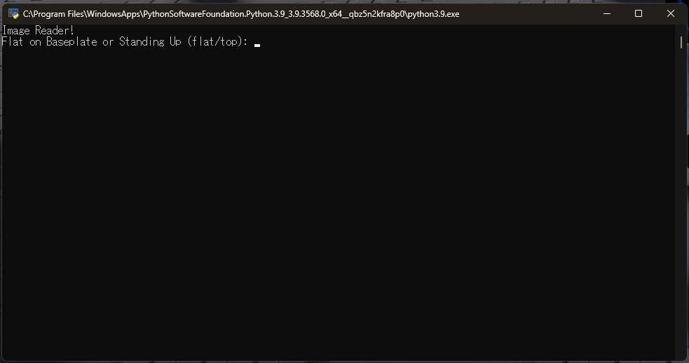
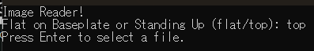
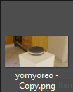
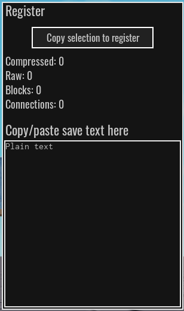
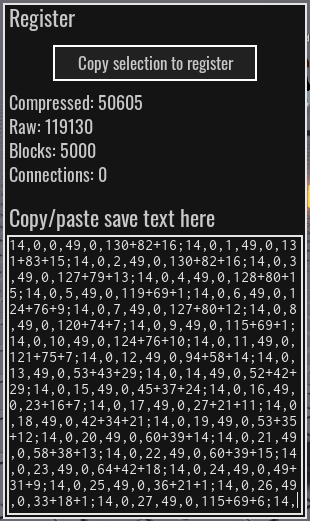
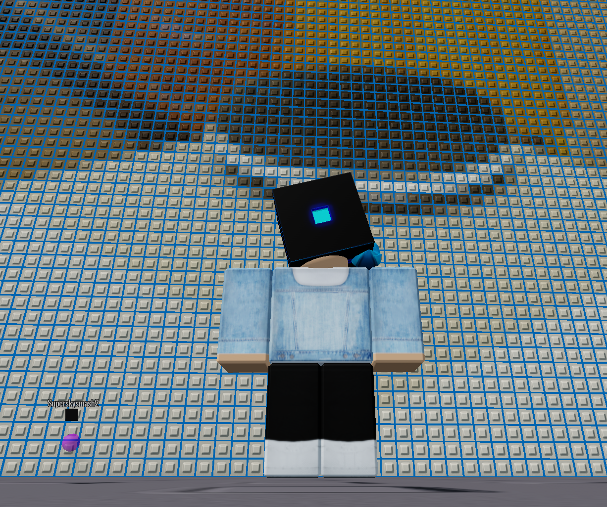
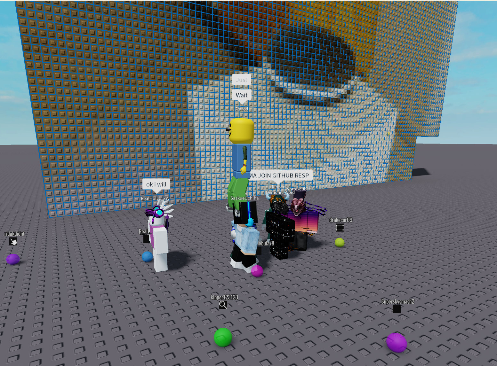

# CM2 Image Gen

Show any type of image file in CM2*.
(*well, any image file supported by OpenCV.)

# Instructions

1) First, well, kinda obvious, but open CM2.
   
2) Then, Open the tool.
   
3) Now, Choose An Orientation for the Image.
   
4) Now, Press Enter, and select a file through the File Picker. DO NOT CHOOSE A LARGE IMAGE! It is recommended to choose an image with a size around 100x50. I'll choose this Oreo that is pre-scaled to size.
   
5) Now, once you press "Open", after a splitsecond, the window should close. That's good! The save text for the picture is now copied to your clipboard. Go back into CM2, and there will be a button that looks like this:
   
   Click it, and a menu like this will show up:
   
6) Click the words "Plain text", and use the paste shortcut. Woah! All of the save text appears!
   
7) MAKE SURE TO PRESS THE ENTER KEY, then now try stamping the build. BOOM! YOU DID IT!
   

# bloopers

lol everyone wanted to be in the final screenshot

